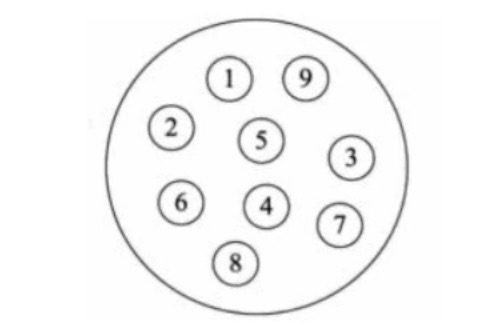
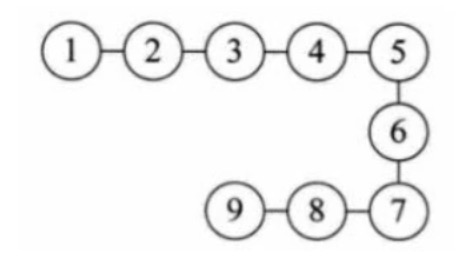
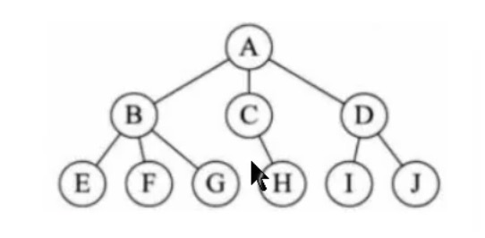
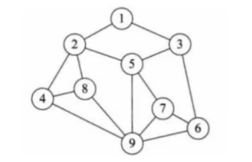
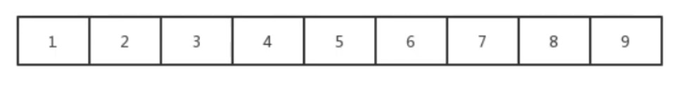
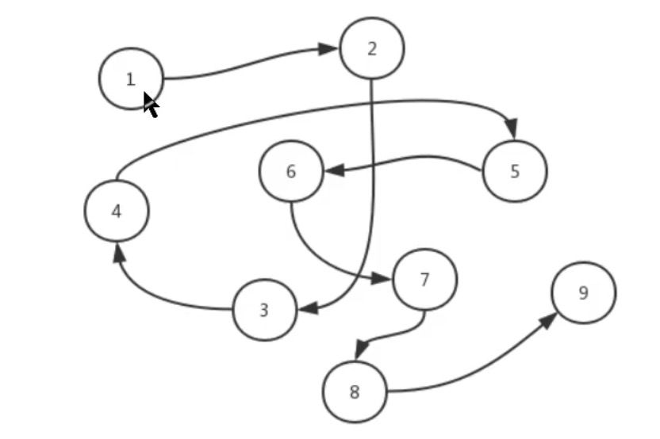

# 数据结构的分类

## 逻辑结构分类

1. 集合结构

   > 集合结构中数据元素除了属于同一集合外，他们之间没有任何其他关系

   

2. 线性结构

   > 线性结构中数据结构存在一对一的关系

   

3. 树形结构

   > 树形结构数据存在一对多的关系

   

4. 图形结构

   > 图形结构数据存在多对多的关系

## 物理结构

物理结构又称存储结构，是逻辑结构在计算机中真正的存储形式。常见的物理结构有顺序存储结构、链式存储结构。

1. 顺序存储结构

   > 把数据存储到地址连续的存储单元里面，比如数组的存储

   

2. 链式存储结构

# 算法的复杂度

## 时间复杂度

## 空间复杂度
