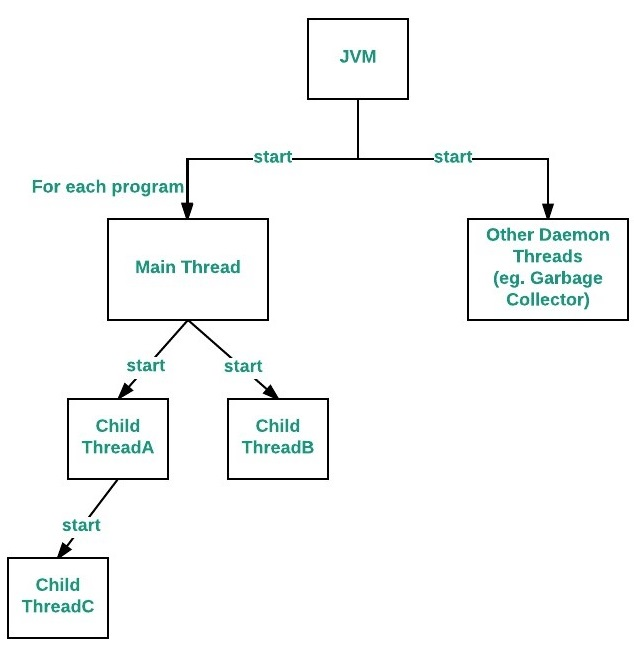
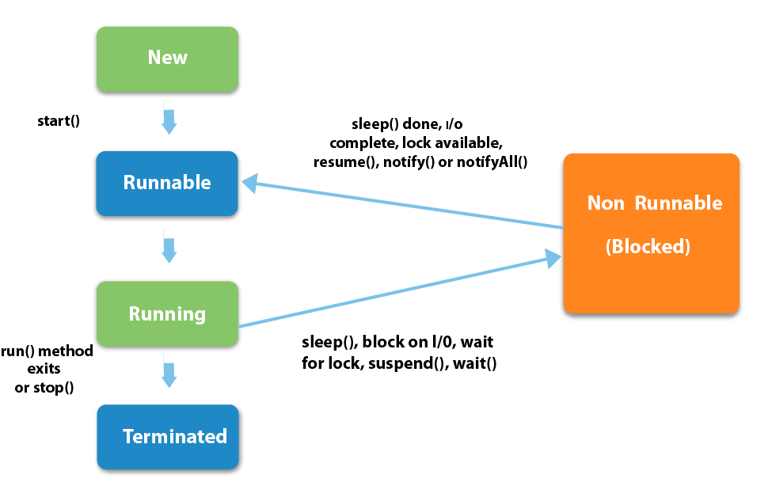

# Java中的线程

## 线程和进程

<b>线程</b>（thread）是操作系统能够进行运算调度的最小单位。同一时间，单个CPU只能执行一个线程。而<b>进程（Process）</b>是系统进行资源分配和调度的基本单位，一个进程中可以包含多个线程。

上面解释可能过于抽象，有兴趣的同学可以参考，阮一峰老师的[进程与线程的一个简单解释](https://www.ruanyifeng.com/blog/2013/04/processes_and_threads.html)，相信对大家理解线程和进程会有很大的帮助。

每个Java程序至少存在一个进程和至少两个线程（主线程和GC线程）。当一个 Java 程序启动时，JVM 会创建主线程，并在该线程中调用程序的 main() 方法。



如上图，JVM 除了创建主线程之外还默默的创建了其它线程，例如，与垃圾收集、对象终止和其它 JVM 内务处理任务相关的线程。

> 线程和进程的区别:

- 进程相对独立，不同进程之间很难共享内存。而线程虽然有它自己的堆栈、自己的程序计数器和自己的局部变量。但是，与分隔的进程相比，进程中的线程之间的隔离程度要小。它们共享内存、文件句柄和其它每个进程应有的状态；
- 一个线程挂掉将导致整个进程崩溃，而不同进程之间一般不影响；
- 进程要比线程消耗更多的计算机资源；

## 创建线程的方法

在Java中，线程创建有四种方式：

1. 继承`Thread`类

   ```java
   public class ChildThred extends Thread{
       @Override
       public void run(){
           System.out.println(Thread.currentThread().getName());
       }
   }
   ```

2. 实现一个`Runnable`接口

   ```java
   Runnable runnable = () -> {
       System.out.println(
           Thread.currentThread().getName()            
       );
   };
   
   Thread childThread = new Thread(runnable);
   ```

3. 使用`FutureTask`创建线程
4. 通过线程池创建

## 线程的生命周期



Java中线程的生命周期分为6种状态：

```java
public enum State {
  NEW,
  RUNNABLE,
  BLOCKED,
  WAITING,
  TIMED_WAITING,
  TERMINATED;
}
```

1. 创建（`NEW`）

当线程创建成功但**没有调用`start` 方法的线程**都处于本状态

2. 可执行/运行中（`RUNNABLE`）

当我们创建线程并执行`start`方法时，线程切换成可执行（Runnable）状态，等待CPU的调度。

```java
thread.start();
```

但处于本状态并不意味着线程正在执行，只有当该线程获得CPU时间片，线程中的`run`方法才得以真正执行。

3. 阻塞（`BLOCKED`）

2. 等待（`WAITING`）
3. 限时等待(`TIMED_WAITING`)
4. 终止（`TERMINATED`）

终止线程的方式有以下几种：

- 自然终止：当线程中没有可运行的程序时，线程自动终止;
- 异常终止：如果在`run`方法执行过程中发生异常而没有被捕获，线程异常终止
- 通过调用`interrupt`方法

## 线程之间的通信

## 线程池

## 参考

- [Java 线程简介](https://www.ibm.com/developerworks/cn/education/java/j-threads/j-threads.html)
- [Life cycle of a Thread](https://www.javatpoint.com/life-cycle-of-a-thread)
- [Life Cycle of a Thread in Java](https://www.baeldung.com/java-thread-lifecycle)
- [Killing threads in Java](https://www.geeksforgeeks.org/killing-threads-in-java/)
- [图解 Java 线程安全 ](https://juejin.im/post/5d2c97bff265da1bc552954b)
- [Java Memory Model](http://tutorials.jenkov.com/java-concurrency/java-memory-model.html)
- [Java 8 Concurrency Tutorial: Threads and Executors](https://winterbe.com/posts/2015/04/07/java8-concurrency-tutorial-thread-executor-examples/)
- [Wiki 线程安全](https://zh.wikipedia.org/wiki/%E7%BA%BF%E7%A8%8B%E5%AE%89%E5%85%A8)
- [Main thread in Java](https://www.geeksforgeeks.org/main-thread-java/)
- [Introduction to Thread Pools in Java](https://www.baeldung.com/thread-pool-java-and-guava)
- [线程池是怎样工作的](https://mp.weixin.qq.com/s/VTBj0KS_vPR_YY2imJYYFw)
- [线程池ThreadPoolExecutor实现原理](https://juejin.im/post/5aeec0106fb9a07ab379574f)
- [深入理解Java线程池：ThreadPoolExecutor](http://www.ideabuffer.cn/2017/04/04/%E6%B7%B1%E5%85%A5%E7%90%86%E8%A7%A3Java%E7%BA%BF%E7%A8%8B%E6%B1%A0%EF%BC%9AThreadPoolExecutor/#addWorker%E6%96%B9%E6%B3%95)