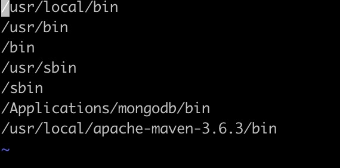

# Linux常用命令

## 后台运行

```bash
commond > outfile 2>&1 &
```

> 关于`2>&1`的用法，[stackoverflow](https://stackoverflow.com/questions/818255/in-the-shell-what-does-21-mean?answertab=active#tab-top)上有解释

标准输出和错误输出都将被重定向到一个叫做outfile的文件中，举个例子：

```bash
java -jar example.war > log.log 2>&1 &
```

## `chmod`文件权限修改

```bash
chmod [options] mode file...
```

> 推荐工具网站：[Chmod Calculator](https://chmodcommand.com/) 生成chmod命令

Linux 将文件调用权限分为三级: `文件所有者（Owner）`、`用户组（Group）`和`其它用户（Other Users）`。


只有文件所有者和超级用户可以修改文件或目录的权限。可以使用`ll`或`ls -l`来查看目录下文件的权限。

常用的几种常用的八进制数字模式：

| Mode | Descript                                |
| ---- | --------------------------------------- |
| 777  | 该文件/目录对所有用户可读、可写、可执行 |

## `systemctl`命令

`systemctl`是 Systemd 的主命令，用于管理系统和服务。

> [Systemd 入门教程：命令篇](http://www.ruanyifeng.com/blog/2016/03/systemd-tutorial-commands.html)

> [Systemd wiki](https://wiki.archlinux.org/index.php/systemd_(%E7%AE%80%E4%BD%93%E4%B8%AD%E6%96%87))

```bash
systemctl [OPTIONS...] COMMAND [UNIT...]
```

## `PATH`的设置

### Mac OS X

打开`/etc/paths` ，添加新的路径，重启terminal



### Linux

1. Open the .bashrc file in your home directory (for example, /home/your-user-name/.bashrc) in a text editor.
2. Add export PATH="your-dir:$PATH" to the last line of the file, where your-dir is the directory you want to add.
3. Save the .bashrc file.
4. Execute command: `source .bashrc`


## >> 和 >的区别

```bash
echo "xxx" > filename 
vs 
echo "xxx" >> filename
```

- `>` 覆盖目标文件的内容
- `>>`追加到目标文件的末尾

